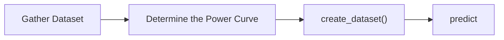
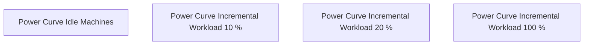
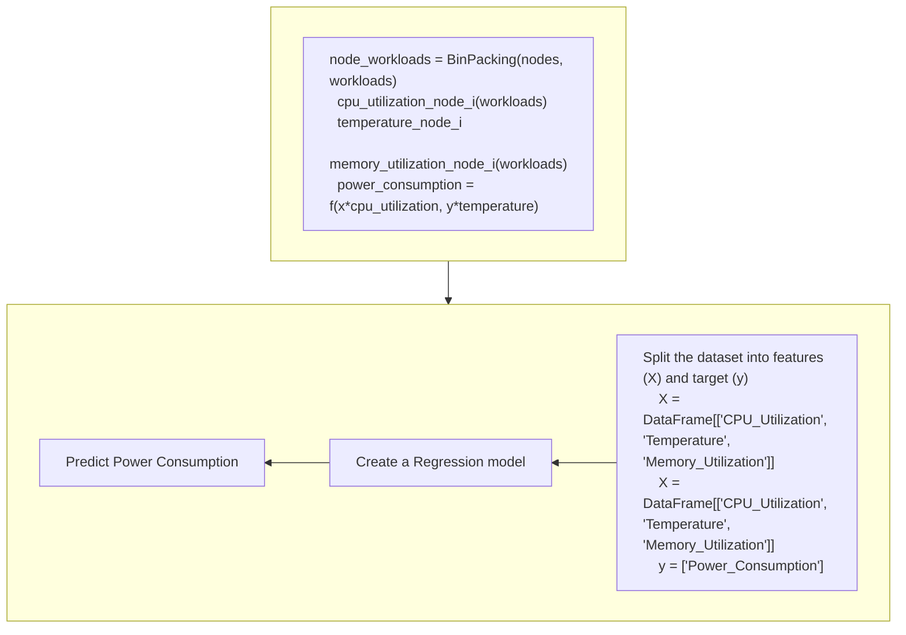

## Offline Power Consumption Model

### CPU Usage
From this [paper](https://american-cse.org/sites/csci2020proc/pdfs/CSCI2020-6SccvdzjqC7bKupZxFmCoA/762400b269/762400b269.pdf) we know

<mark>The power consumption value depends on both the CPU usage rate and the temperature around the server.
We observe that the server's power consumption increased significantly when the CPU usage was between 10% and 30%, and then increased gradually after that</mark>

### Temprature:

- How to get temperature metrics?
On clusers running inside self managed cluster we can get it by enabling BMC. How will it be gathered on cloud?

## Metrics to choose:

**1. CPU Usage Rate of the Nodes**
- get cpu usage of the nodes from load-watcher 
- `n` = number of cpus within node `a`
- `N` = total number of nodes

$$CPU\_USAGAE\_NODE_a = sum_{k=1}^n(CPU\_USAGAE_k)$$
$$CPU\_TOTAL_a = n$$
$$CPU\_RATE_a = sum_{k=1}^n(CPU\_RATE_k)$$
$$CPU\_RATE_k = (CPU\_USAGAE_k / n) * 100$$

**2. Memory Usage Rate of the Nodes**

**3. Characteristics of the Workloads**
- CPU and Memory Requests and Limits
- The minimum and maximum CPU and memory resources the workload requires. (For scheduling assume max)

## Regression Model


<script src="https://cdnjs.cloudflare.com/ajax/libs/mermaid/8.14.0/mermaid.min.js"></script>





### Gather Dataset

Gather data at various incremental workload for each node

>This testing will be done on machines, not on cluster


### Determine the Power Curve

- Linear? Concave? Convex? Complicated?


 - Determine the function for `total_power_consumption` of the node
```
total_power_consumption = f(x*cpu_usage,y*temperature)
```
### Create Dataset

